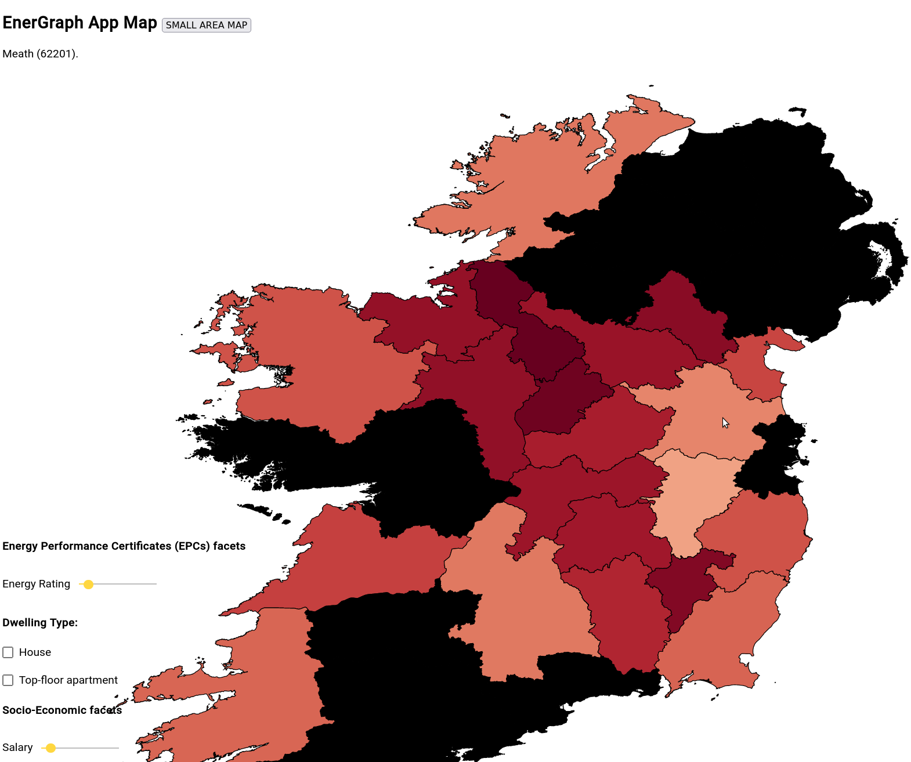
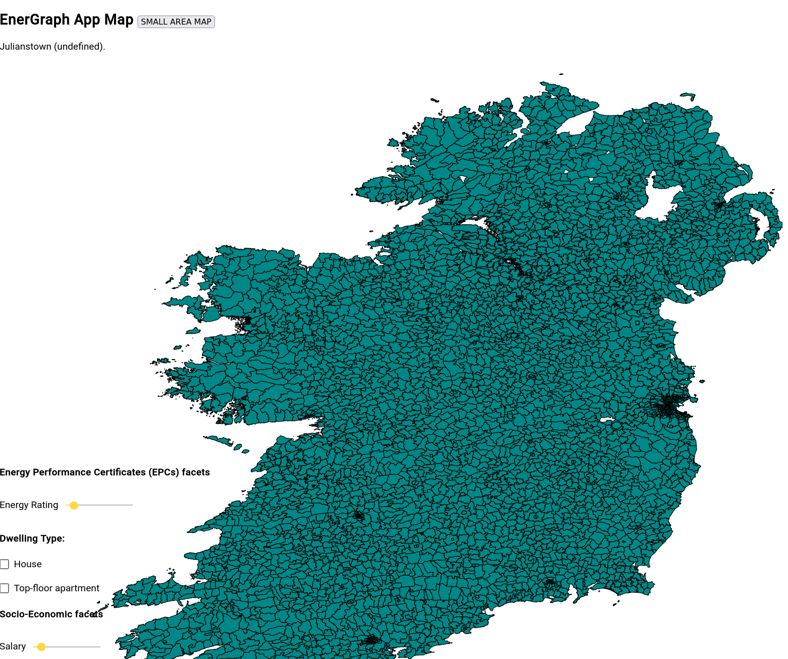
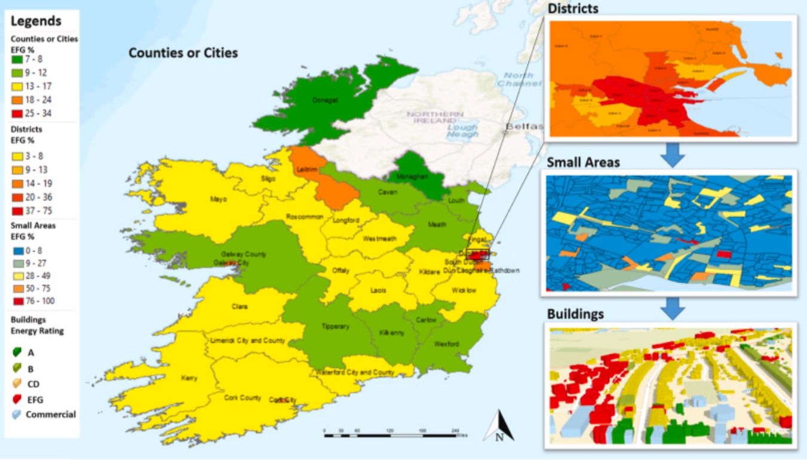
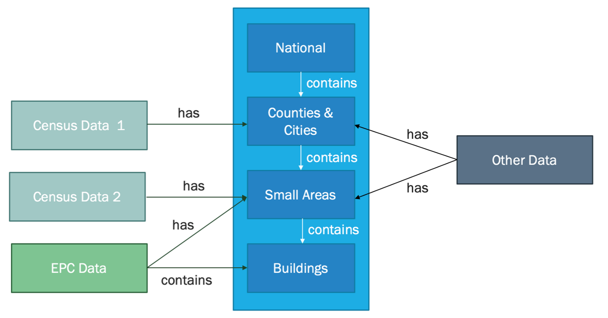

# EnerGraph App
(original challenge description down below)

Angular and D3 interactive heatmap-map visualization tool, using a GraphDB backend to query and show Energy Performance Certificates across Counties and Electoral Divisions in Ireland.

This demo was developed at a hackathon. It requires a populated GraphDB for querying the EPC data, and GeoJSON map data, which is tool large to include in this repo.

The GeoJSON maps for Counties and Electoral Divisions can be found here:
https://www.townlands.ie/page/download/
place them in assets folder, with the names: 
"counties.geojson"
"eds.geojson"

Some of the provided data has a granularity matching the "Small Areas" style of boundaries.
Attemps to make the "Small\_Areas\_Ungeneralised_-_OSi_National_Statistical_Boundaries_-_2015.geojson" work with the GraphDB were not successful within the timeframe.

# Challenge 1: Multi-spatial-scale linking and inferencing challenge

**Champions**: Cathal Hoare and James O’Donnell with Usman Ali available over Zoom. 

**Number of people per team**: 3-4
**Anticipated workload**: about 20-25 hours per person, which includes time for preparation of the presentation.

## Learning objectives for this challenge
To be able to analyse and understand the available datasets. 
To be able to formulate viable questions related to the challenge.
To import heterogeneous datasets into a graph database.
To link diverse datasets.
To write queries to extract knowledge for the linked dataspace and answer the research questions.
To present your findings to a technical and non-technical audience.

## Challenge description: 

The Irish Government aims to renovate 500,000 homes between now and 2050 in order to significantly reduce the carbon footprint of the nation’s building stock. There are many pathways to achieving this goal and policy makers are looking for your help to identify the best opportunities. 

Ireland has a building stock database in the form of Energy Performance Certificates  (EPCs). However, these databases have noted issues and do not comprehensively represent the entire building stock [1]. Stakeholders such as policy makers and stock level analysts need insights derived from multiple and related datasets in order to understand the energy performance of buildings over multiple geographic scales [2]. Furthermore, it remains an important challenge to use these databases to identify intelligent and scalable renovation decisions and recommendations for different stakeholders, from policy makers to homeowners (Figure 1).

|  |
|:--:|
| <b>Figure. 1. Irish multi-scale map shows the percentage of EFG building energy rating prediction results that helps to estimate energy demand distributions at multiple-scale [1].</b>|

The challenge is to use available data to identify renovation opportunities as relationships within the datasets that can provide added-value information for decision makers (e.g. what socio-economic information can be coupled with the EPC database and at what geographical scales).  This problem can be solved by developing a linked data solution to identify relationships embedded in the ingested data and use these to create associations between data representing the same real world object or analysis context.

|  |
|:--:|
| <b>Figure. 2. Relevant relationships and links between different datasets.</b>|

## Success:
Inference novel findings from linking socio-economic data with EPC data to highlight the geographical areas (at small area and county level) in greatest need of renovation (lower EPC score with factors from census sources). 

Within the coding challenge you will work on the following tasks:
Examine the existing data and define a suitable set of links for the datasets.
Develop the scenarios that can help stakeholders to inform decision making, that can improve building energy performance at multi-scale.

## Challenger Research Questions:
* Can you define a suitable set of links for the datasets available?
* What are the key socio-economic features from the dataset that would be useful for energy planning purposes?
* Can you investigate the factors that influence building energy performance at a small area scale?

## Data Sets available:

* Irish Census Data [Download](https://drive.google.com/drive/folders/13JUb8uIGvNHYLtqk1gWqaEl0Ihi6E6-h?usp=sharing) 
  * Countries or Cities
  * Small areas (Neighbourhood) 
* Irish EPC data [Download](https://drive.google.com/drive/folders/13JUb8uIGvNHYLtqk1gWqaEl0Ihi6E6-h?usp=sharing) | [Terms and Conditions](https://ndber.seai.ie/BERResearchTool/TnC.pdf)
* Other relevant datasets that you can find

## Challenge Instructions
Bring your laptop.

## Tools
* Excel
* GraphDB

## References
1. Ali, U., Shamsi, M.H., Bohacek, M., Purcell, K., Hoare, C., Mangina, E. and O’Donnell, J., 2020. A data-driven approach for multi-scale GIS-based building energy modeling for analysis, planning and support decision making. Applied Energy, 279, p.115834.
2. O. Pasichnyi, J. Wallin, F. Levihn, H. Shahrokni, and O. Kordas, “Energy performance certificates—new opportunities for data-enabled urban energy policy instruments?” Energy policy, vol. 127, pp. 486–499, 2019.
